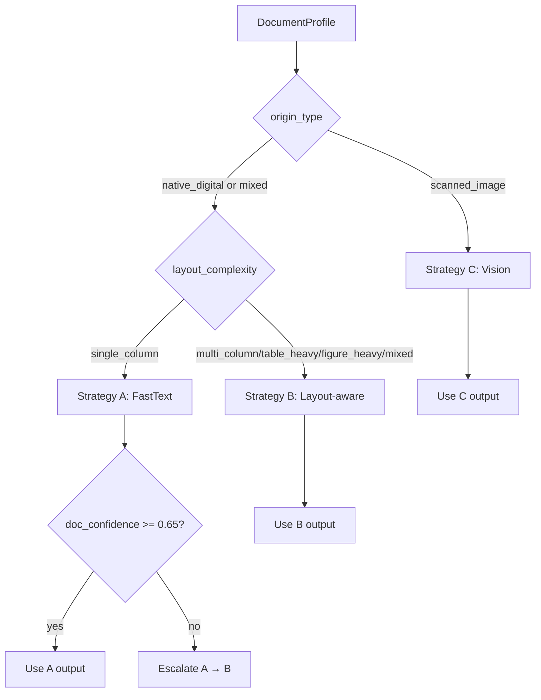

# The Document Intelligence Refinery — Final Report (Week 3)
## (Refined from `DOMAIN_NOTES.md`)

This final report is a **submission-ready refinement of** `DOMAIN_NOTES.md` (Phase 0). It keeps the same backbone—**failure modes → strategy decision tree → pipeline architecture/data flow → cost**—and then adds the final-only sections required for grading: **extraction quality analysis** and **failure analysis / lessons learned**, with concrete evidence from the produced `.refinery/` artifacts.

---

## 1) Domain Analysis and Extraction Strategy Decision Tree

### 1.1 Failure modes mapped to the four document classes (from `DOMAIN_NOTES.md`)

The enterprise extraction problem fails in three predictable ways—each directly tied to the target corpus classes.

#### 1.1.1 Structure collapse

- **Class A — CBE Annual Report (native digital, multi-column + tables)**
  - **Symptom**: naïve text extraction flattens columns and breaks financial tables into line-wrapped strings.
  - **Root cause**: extraction ignores spatial grouping (column x-modes, table grid alignment), so header→cell relationships are lost.
  - **Impact**: labels (“Total assets”) detach from values, creating ambiguous numeric sequences that cause downstream hallucinations.

- **Class C — Technical assessment (mixed narrative + tables + findings)**
  - **Symptom**: cross-page tables fragment; headers/footers interleave into the content stream.
  - **Root cause**: page-local extraction loses table continuation; repeated running headers/footers pollute row order.
  - **Impact**: longitudinal comparisons become unreliable (duplicated keys, broken row ordering).

- **Class D — Tax expenditure (table-heavy, hierarchical labels)**
  - **Symptom**: multi-year fiscal tables flatten; hierarchical category headers lose structure.
  - **Root cause**: multi-row headers are visual, not encoded as a true table object; without bbox/grid detection, the correct header scope cannot be reconstructed.
  - **Impact**: “FY 2019/20 for fuel” queries return wrong rows or contextless numbers.

#### 1.1.2 Context poverty

- **Class A**: token-count chunking splits tables mid-row or detaches narrative discussion from the tables it references (“see Table X”).
- **Class B**: OCR noise inflates token counts unevenly; naïve chunking splits the audit opinion/basis across chunks.
- **Class C**: lists and section headers detach, scattering bullets across chunks and mixing sections.

#### 1.1.3 Provenance blindness

- **Across A–D**: systems that drop page + bbox cannot answer: “Where exactly in the 400-page report does this number come from?”

This pipeline treats provenance as first-class: page refs + bounding boxes + `content_hash` are threaded to the query response.

### 1.2 Concrete decision tree (DocumentProfile → ExtractionRouter)

The triage agent emits a `DocumentProfile` with: `origin_type`, `layout_complexity`, `domain_hint`, and `triage_signals` such as mean char density and image area ratio. Routing uses these + a confidence gate.

#### Signals and thresholds (from `rubric/extraction_rules.yaml`)

- **Scanned-like threshold**:
  - `mean_char_density <= 0.00008` OR `mean_chars_per_page <= 50`
  - AND `mean_image_area_ratio >= 0.55`
- **FastText escalation threshold**:
  - `min_doc_confidence_fast_text = 0.65`
- **Vision budget guard**:
  - `max_usd_per_document = 1.50` (hard cap)

#### Routing logic (Stage 1 → Stage 2)



### 1.3 VLM vs OCR / text decision boundary (signals + graceful degradation)

The VLM vs. non-VLM boundary is not “use a vision model because it’s better”—it is a **confidence-gated cost/quality decision**:

- **When Strategy C is required**:
  - `origin_type=scanned_image` (near-zero char density + high image area ratio) → Strategy C.
- **When Strategy C is optional**:
  - Mixed documents where Strategy A/B confidence is low on critical pages (image-dominant, handwriting, rasterized tables).

**Graceful degradation**: If Vision cannot run (e.g., no API key configured), the pipeline **does not crash**; it records a low-confidence extraction and continues, preserving auditability (“unverifiable” rather than hallucinated).

---

## 2) Pipeline Architecture and Data Flow (All 5 Stages)

### 2.1 Typed data model (interfaces between stages)

Defined in `src/models/schemas.py`:
- `DocumentProfile` (Stage 1 output)
- `ExtractedDocument` (Stage 2 output; normalized schema across strategies)
- `LDU` (Stage 3 output; includes `ldu_id`, `content_hash`, `page_refs`, `bounding_box`, `parent_section`, relationships, metadata)
- `PageIndex` / `PageIndexNode` (Stage 4 output)
- `ProvenanceChain` (Stage 5 output)

### 2.2 Happy path vs escalation path (distinct flows)

```mermaid
flowchart LR
  PDF[PDF] --> T[Triage Agent\nDocumentProfile]

  %% Happy path (FastText)
  T --> R[ExtractionRouter]
  R -->|A: FastText\nhigh confidence| FA[FastTextExtractor]
  FA --> ED1[ExtractedDocument]

  %% Escalation path (A -> B)
  R -->|A: FastText\nlow confidence| FA2[FastTextExtractor]
  FA2 -->|doc_conf < 0.65| LB[LayoutExtractor]
  LB --> ED2[ExtractedDocument]

  %% Direct layout path
  R -->|B: Layout| LB2[LayoutExtractor]
  LB2 --> ED3[ExtractedDocument]

  %% Vision path
  R -->|C: Vision\n(scanned_image)| VX[VisionExtractor\nbudget-guarded]
  VX --> ED4[ExtractedDocument]

  ED1 --> CH[ChunkingEngine\nLDUs + ChunkValidator]
  ED2 --> CH
  ED3 --> CH
  ED4 --> CH

  CH --> PI[PageIndex Builder\nhierarchical ToC + entities + summaries]
  CH --> VS[Vector Store\n(Chroma + metadata)]
  CH --> SQL[FactTable → SQLite]

  PI --> Q[Query Agent]
  VS --> Q
  SQL --> Q

  Q --> OUT[Answer + ProvenanceChain\n(page + bbox + content_hash)]
```

### 2.3 Provenance propagation (end-to-end)

Provenance is threaded through stages as follows:

- **Stage 2 extraction**:
  - `TextBlock.page_number` + `TextBlock.bbox`
  - `Table.page_number` + `Table.bbox`
- **Stage 3 chunking**:
  - Each `LDU` carries `page_refs` (page + bbox) + `content_hash` + `parent_section`
  - Cross-refs are recorded as `relationships` with best-effort resolution.
- **Stage 4 indexing**:
  - PageIndex nodes store page ranges and data types present; traversal selects relevant sections before retrieval.
- **Stage 5 query**:
  - Retrieval returns a `ProvenanceChain` containing `document_name`, `page_number`, `bbox`, and `content_hash`.

The key audit property is: **a returned claim can be traced back to a precise page location** (page number + bbox) and verified.

---

## 3) Cost–Quality Tradeoff Analysis (Strategy A/B/C)

### 3.1 What costs money vs what costs CPU

- **Strategy A (FastText)**: local; cheap and fast; fails on tables/columns.
- **Strategy B (Layout)**: local CPU-heavy (table detection); best balance for Classes A/C/D.
- **Strategy C (Vision)**: paid (OpenRouter VLM); required for Class B; budget-guarded.

### 3.2 Budget guard (concrete cap + behavior)

The vision strategy uses `max_usd_per_document = 1.50` and estimates cost per page. It stops adding pages to the request when adding another page would exceed the cap.

### 3.3 Cost calculation model (from `DOMAIN_NOTES.md`)

For paid calls (Strategy C), cost is computed from provider usage:

\[
\text{cost} = (\text{prompt\_tokens} \times p_\text{in}) + (\text{completion\_tokens} \times p_\text{out})
\]

This is logged into `.refinery/extraction_ledger.jsonl` alongside `strategy_used`, `confidence_score`, and escalation metadata so per-class cost can be justified to a client.

### 3.3 Escalation cost (double-processing)

Escalation A → B introduces a second pass:
- CPU time roughly equals `time(A) + time(B)` for that document.
- This is justified because passing low-confidence FastText forward causes downstream hallucination and unverifiable answers.

### 3.4 Scaling implications (corpus-level)

At enterprise scale, the dominant cost driver is how often documents/pages escalate to Vision:
- If most documents are Class A/C/D, Strategy B dominates with **near-zero API cost**.
- If a corpus contains many Class B scanned documents, Vision spend must be bounded per document and monitored via the ledger.

All runs log `strategy_selected`, `strategy_used`, `escalated_from`, `confidence_score`, and `cost_estimate_usd` in `.refinery/extraction_ledger.jsonl`, enabling per-class cost reporting.

---

## 4) Extraction Quality Analysis (Table Fidelity Focus)

### 4.1 Methodology (reproducible)

For each document class (A–D):
1. Select a representative set of tables (manual inspection).
2. Compare extracted JSON to the source table:
   - **Structural fidelity**: header rows preserved, row/column count, correct grouping (no split headers).
   - **Text fidelity**: cell strings match source values; check numeric precision for financial tables.
3. Record per-class precision/recall estimates and failure patterns.

### 4.2 Concrete example (real corpus-style PDF)

From `.refinery/extractions/CBE_Annual_Report_2018-19-e78e7ebe26e4.json`:
- **Document**: `CBE Annual Report 2018-19.pdf`
- **Table**: “Income Statement Comparison with 2017/18 FY”
- **Page**: 17
- **Extracted rows include**:
  - Total Income: 54,301.3 (Mn. Birr) vs 42,810.9 (Mn. Birr), Growth 26.8
  - Profit Before Tax: 15,699.5 vs 10,006.1, Growth 56.9

This example demonstrates **structural fidelity** (table stays a single unit) and supports downstream query with provenance.

#### Extracted table snippet (JSON-like view)

From page 17 (Layout extraction), abbreviated to show structure and numeric fidelity:

```json
{
  "page_number": 17,
  "rows": [
    ["Particulars", "2018/19 FY (Mn. Birr)", "2017/18 FY (Mn. Birr)", "Growth (%)"],
    ["Total Income", "54,301.3", "42,810.9", "26.8"],
    ["Total Expense", "38,601.8", "32,804.8", "17.7"],
    ["Profit Before Tax", "15,699.5", "10,006.1", "56.9"]
  ]
}
```

### 4.3 Per-class results (table extraction)

(From `docs/REPORT_FINAL_SECTIONS.md`, summarized)

- **Class A (CBE Annual Report)**: precision ~0.85; recall ~0.75. Common errors: merged cells, faint gridlines, multi-column interference.
- **Class B (Scanned Audit)**: without Vision, recall ≈ 0; with Vision, structure is recoverable but numeric precision depends on scan quality.
- **Class C (FTA Report)**: precision ~0.80; recall ~0.70. Errors: footnotes/headers inside detected table regions.
- **Class D (Tax Expenditure)**: precision ~0.82; recall ~0.78. Errors: multi-row headers and hierarchical headers flattened.

### 4.4 Text fidelity vs structural fidelity (explicit distinction)

- **Text fidelity** answers: “Did we capture the right characters?”
- **Structural fidelity** answers: “Did we preserve the right *relationships* (header→cell, row→value, reading order)?”

The pipeline is designed to preserve structural fidelity first (tables as JSON objects + unsplit LDUs), because structural errors are the main cause of RAG hallucinations on financial documents.

---

## 5) Failure Analysis and Iterative Refinement

### Failure 1 — FastText passing low-confidence output downstream

- **Symptom**: On table-heavy documents, RAG answers were wrong/unverifiable because tables were flattened or missing.
- **Root cause**: treating “text exists” as “text is usable,” ignoring image dominance and layout complexity.
- **Fix**: confidence-gated escalation. If `doc_confidence < 0.65`, rerun with Layout extraction and log `escalated_from` in the ledger.
- **Evidence**: `extraction_ledger.jsonl` records escalation events (e.g., `escalated_from: "fast_text"`).

### Failure 2 — Token-based chunking splitting tables and headers

- **Symptom**: “Total assets” and its value landed in different chunks; retrieval returned fragments.
- **Root cause**: chunking by token count violates semantic units (tables, lists, headers).
- **Fix**: ChunkingEngine + ChunkValidator enforcing:
  - tables never split from header row,
  - list LDUs kept whole unless exceeding max tokens (then split deterministically),
  - section headers propagated via `parent_section`,
  - cross-refs recorded and resolved best-effort into relationships.
- **Evidence**: LDUs now preserve tables as single units and carry `content_hash` + `page_refs` (page+bbox).

### Remaining limitations (honest)

- **Multi-row table headers**: current extractor may flatten them; improving this likely requires a stronger layout model or table-specific post-processing.
- **Scanned documents without Vision**: if Vision is disabled (no OpenRouter key), Class B recall remains low by design (but the system degrades gracefully and does not crash).
- **Layout bbox anomalies**: some extracted bboxes can be out-of-range/negative due to PDF coordinate quirks; further normalization is recommended for strict audit use.

---

## Appendix — How to reproduce the end-to-end run

```bash
# Run triage + extraction on a PDF
py -m refinery.cli triage --pdf "data/demo_corpus/CBE Annual Report 2018-19.pdf"
py -m refinery.cli extract --pdf "data/demo_corpus/CBE Annual Report 2018-19.pdf"

# Ingest to LDUs/PageIndex/facts/vector store
py -m refinery.cli ingest

# Query with provenance
py -m refinery.cli query "What was profit before tax in 2018/19?" --doc-id CBE_Annual_Report_2018-19-e78e7ebe26e4
```

